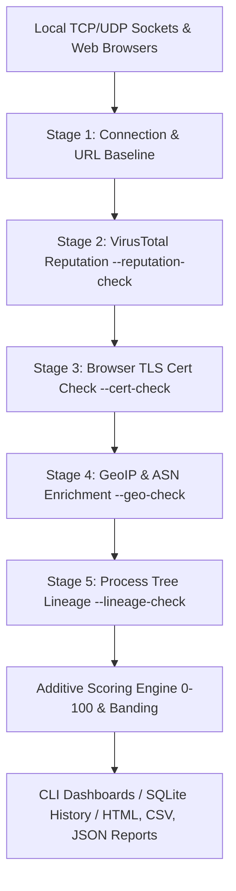
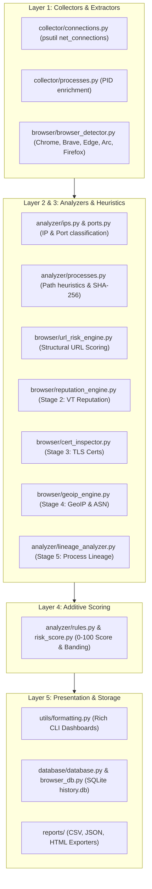

# Feluda


A Python-based **defensive security monitoring, threat detection & triage** tool for Windows.

Feluda watches your machine's active network connections and web browsers in real time, maps each socket to its owning process, inspects executables, domain certificates, remote IPs, and parent process trees, and applies **5-stage rule-based heuristics** to flag *potentially suspicious* activity with a transparent, explainable **risk score (0–100)**.

> ⚠️ **This is a monitoring/triage tool, not an antivirus.** Every flag is a *signal* with an explicit reason list — never a definitive threat determination.

---

## Table of Contents

- [5-Stage Triage Engine](#5-stage-triage-engine)
- [Architecture Overview](#architecture-overview)
- [Features](#features)
- [Install](#install)
- [Usage](#usage)
- [Risk Bands & Rule Weights](#risk-bands--rule-weights)
- [Project Layout](#project-layout)
- [Verification Against Native Tools](#verification-against-native-tools)
- [Design Principles](#design-principles)

---

## 5-Stage Triage Engine

Feluda evaluates threats across five progressive, additive detection stages:



1. **Stage 1 — Base Connection & URL Heuristics**:
   - `psutil.net_connections()` mapping to PIDs, execution path analysis, baseline training.
   - Lock-free browser tab extraction (Chromium & Firefox) with offline structural URL checks (Homographs, Typosquatting, IP Literals, Suspicious TLDs, Percent-encoding).
2. **Stage 2 — VirusTotal Reputation (`--reputation-check`)**:
   - Asynchronous, TTL-cached VirusTotal lookups (`reputation_engine.py`) with automatic rate-limiting (`VTQueue`) for external IPs and URLs.
3. **Stage 3 — TLS Certificate Inspection (`--cert-check`)**:
   - Live socket inspection (`cert_inspector.py`) detecting expired, self-signed/untrusted certs, short validity windows, or SAN hostname mismatches for HTTPS URLs.
4. **Stage 4 — GeoIP & ASN Enrichment (`--geo-check`)**:
   - IP geolocation & Autonomous System Network mapping (`geoip_engine.py`), flagging unexpected countries or high-risk bulletproof hosting/non-CDN datacenters.
5. **Stage 5 — Process Tree & Parent-Child Lineage Analysis (`--lineage-check`)**:
   - Deep parent-child process tree walking (`lineage_analyzer.py`), flagging Office spawning shells, browser spawning suspicious binaries, script interpreters with abnormal parents, orphaned processes, and command-line obfuscation.

---

## Architecture Overview



---

## Features

- **Real-time connection monitoring** (TCP/UDP) via `psutil.net_connections()`.
- **PID → process mapping** (process name, exe path, username, create time).
- **Remote-IP classification**: `PRIVATE`, `LOOPBACK`, `LINK-LOCAL`, `PUBLIC`, `MULTICAST`.
- **Port intelligence**: Config-driven well-known vs. unusual remote service mapping.
- **Process path analysis & hashing**: Detects execution from `Temp`, `Downloads`, `Users\Public`; computes SHA-256 for notable executables.
- **Browser & URL threat detection**: Supports **Chrome**, **Brave**, **Edge**, **Arc**, and **Firefox** (via `recovery.jsonlz4` session parsing & fallback `places.sqlite` extraction).
- **Multi-Stage Opt-In Enrichment**:
  - VirusTotal IP & URL reputation checking (`--reputation-check`).
  - HTTPS TLS Certificate inspection (`--cert-check`).
  - GeoIP & ASN hosting provider classification (`--geo-check`).
  - Parent-child process lineage tree walking (`--lineage-check`).
- **Forensic Lineage Drill-Down**: Detailed parent process chain inspection for historical scans (`--show-lineage <id>`).
- **SQLite history & baseline learning**: Logs snapshots to `database/history.db` and learns `process:port` normal behavior.
- **Multi-format export**: Comprehensive CSV, JSON, and dark-themed self-contained HTML audit reports.
- **Local-only scope by default**: Inspects local sockets and browser profile snapshots without unauthorized remote network scanning.

---

## Install

```powershell
# 1. Clone repository & enter directory
cd D:\Feluda

# 2. Create and activate virtual environment
python -m venv .venv
.\.venv\Scripts\Activate.ps1

# 3. Install required dependencies
pip install -r requirements.txt
```

---

## Usage

```powershell
# Point-in-time connection triage scan
python main.py scan

# Scan with all 5 Stages enabled
python main.py scan --reputation-check --cert-check --geo-check --lineage-check

# Real-time background monitoring guard
python main.py monitor --interval 5

# Browser & URL threat detection scan / live watch mode
python main.py browsers
python main.py browsers --live --interval 3

# Baseline learning (train normal process -> port patterns)
python main.py baseline

# Query forensic history & drill down into process lineage
python main.py history --limit 50 --level HIGH
python main.py history --show-lineage 42

# Export audit findings to CSV, JSON, and self-contained HTML report
python main.py export --format all --scan-browsers
```

Set UTF-8 encoding in Windows PowerShell for proper Rich table rendering:

```powershell
$env:PYTHONIOENCODING='utf-8'
```

---

## Risk Bands & Rule Weights

| Score Range | Risk Level | CLI Color |
|:---:|:---:|:---:|
| **0–24** | **LOW** | Green |
| **25–49** | **MEDIUM** | Yellow |
| **50–74** | **HIGH** | Red |
| **75–100** | **CRITICAL** | Bold Red |

All thresholds, weights, and rules live in [`config/rules.json`](config/rules.json) — tune them without touching code.

---

## Project Layout

```
Feluda/
├── main.py                     # CLI entry: scan / monitor / baseline / history / export / browsers
├── collector/
│   ├── connections.py          # psutil.net_connections() + ConnectionStore repeat tracker
│   ├── processes.py            # PID → process metadata enrichment
│   └── network.py              # Local IP classification & TCP state labels
├── analyzer/
│   ├── ips.py                  # IP address classification (PUBLIC/PRIVATE/...)
│   ├── ports.py                # Well-known & unusual port intelligence
│   ├── processes.py            # Location heuristics & SHA-256 file hashing
│   ├── lineage_analyzer.py     # Stage 5: Parent-child process tree analyzer & DB store
│   ├── rules.py                # Additive weighted rule engine
│   └── risk_score.py           # 0–100 risk scoring & band mapping
├── browser/
│   ├── browser_detector.py     # Chromium & Firefox active tab / session / history extraction
│   ├── url_risk_engine.py      # Stage 1 structural URL risk heuristics
│   ├── reputation_engine.py    # Stage 2: VirusTotal API integration & async queue
│   ├── cert_inspector.py       # Stage 3: Live HTTPS TLS certificate inspection
│   ├── geoip_engine.py         # Stage 4: GeoIP & ASN enrichment engine
│   └── browser_db.py           # SQLite persistence for browser URLs & reputation caches
├── monitor/
│   ├── pipeline.py             # Single-scan orchestration pipeline
│   └── realtime.py             # Real-time polling loop & boxed alert renderer
├── database/
│   └── database.py             # SQLite connection history & baseline database
├── reports/
│   ├── csv_export.py           # CSV report generator
│   ├── json_export.py          # Structured JSON exporter
│   └── html_export.py          # Dark-themed self-contained HTML audit report builder
├── utils/
│   ├── config_loader.py        # Centralized settings loader for rules.json
│   ├── formatting.py           # Rich CLI tables, alert panels, HTML formatting
│   └── logger.py               # Structured event logging (logs/feluda.log)
├── config/rules.json           # Master configuration for weights, ports, and thresholds
└── logs/feluda.log             # Detection event audit log
```

---

## Verification Against Native Tools

Feluda's records mirror what `netstat -ano` + `tasklist` show:

```powershell
netstat -ano | findstr <PID>
tasklist /FI "PID eq <PID>"
```

---

## Design Principles

1. **Signals, not verdicts.** Every alert lists *why* a score was given with explicit reason lists.
2. **Modular architecture.** Logic is strictly divided into collector, analyzer, browser, monitor, and report modules.
3. **Config-driven engine.** All weights, thresholds, and brand targets live in `config/rules.json`.
4. **Local-first & privacy aware.** Inspects local sockets and browser profile snapshots without unauthorized external network scanning.
5. **Transparency & Explainability.** Legible CLI output, structured event logs, and forensic lineage drill-down.
