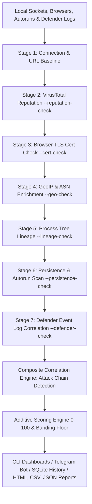

# Feluda


A Python-based **defensive security monitoring, threat detection & triage** tool for Windows.

Feluda watches your machine's active network connections and web browsers in real time, maps each socket to its owning process, inspects executables, domain certificates, remote IPs, parent process trees, autorun locations, and Windows Defender event logs, and applies a **7-stage rule-based heuristics & correlation engine** to flag *potentially suspicious* activity with a transparent, explainable **risk score (0–100)** and **attack chain narrative**.

> ⚠️ **This is a monitoring/triage tool, not an antivirus.** Every flag is a *signal* with an explicit reason list — never a definitive threat determination.

---

## Table of Contents

- [7-Stage Triage & Correlation Engine](#7-stage-triage--correlation-engine)
- [Architecture Overview](#architecture-overview)
- [Features](#features)
- [Install](#install)
- [Usage](#usage)
- [Telegram Remote Control](#telegram-remote-control)
- [Risk Bands & Rule Weights](#risk-bands--rule-weights)
- [Project Layout](#project-layout)
- [Verification Against Native Tools](#verification-against-native-tools)
- [Design Principles](#design-principles)

---

## 7-Stage Triage & Correlation Engine

Feluda evaluates threats across seven progressive, additive detection stages, topped by a composite correlation layer:



1. **Stage 1 — Base Connection & URL Heuristics**:
   - `psutil.net_connections()` mapping to PIDs, execution path analysis, baseline training.
   - Lock-free browser tab extraction (Chromium & Firefox) with offline structural URL checks (Homographs, Typosquatting, IP Literals, Suspicious TLDs, Percent-encoding).
2. **Stage 2 — VirusTotal Reputation (`--reputation-check`)**:
   - Asynchronous, TTL-cached VirusTotal lookups (`reputation_engine.py`) with automatic rate-limiting (`VTQueue`) for external IPs and URLs.
3. **Stage 3 — TLS Certificate Inspection (`--cert-check`)**:
   - Live socket inspection (`cert_inspector.py`) detecting expired, self-signed/untrusted certs, short validity windows, or SAN hostname mismatches for HTTPS URLs.
4. **Stage 4 — GeoIP & ASN Enrichment (`--geo-check`)**:
   - IP geolocation & Autonomous System Network mapping (`geoip_engine.py`), flagging unexpected countries or high-risk bulletproof hosting/non-CDN datacenters.
5. **Stage 5 — Process Tree & Parent-Child Lineage Analysis (`--lineage-check`)**:
   - Deep parent-child process tree walking (`lineage_analyzer.py`), flagging Office spawning shells, browser spawning suspicious binaries, script interpreters with abnormal parents, orphaned processes, and command-line obfuscation.
6. **Stage 6 — Persistence & Autorun Scanning (`--persistence-check`)**:
   - Enumerates Windows Run/RunOnce registry keys, Startup folder shortcuts (COM), Task Scheduler COM jobs, and Windows services, cross-referencing binaries against active process connections.
7. **Stage 7 — Windows Defender Event Log Correlation (`--defender-check`)**:
   - Native Windows Event Log correlation (`defender_correlator.py` via `EvtQuery` for Event IDs 1116, 1117, 1006), matching recent OS Defender detections against active connection processes and identifying unmonitored detection gaps.
8. **Composite Correlation Engine (Attack Chain Detection)**:
   - Evaluates findings across all 7 stages per target identity (resolved executable path or PID). When 2+ distinct stages flag the same target, applies multi-stage score bonuses (**+25** for 2 stages, **+40** for 3 stages, **+60** for 4+ stages), floors the risk level at **`HIGH`** (minimum score 50), generates a deterministic headline narrative, and persists the chain into `correlated_chains`.

---

## Architecture Overview

```mermaid
graph TB
    subgraph Collectors["Layer 1: Collectors & Extractors"]
        C1["collector/connections.py (psutil net_connections)"]
        C2["collector/processes.py (PID enrichment)"]
        C3["browser/browser_detector.py (Chrome, Brave, Edge, Arc, Firefox)"]
        C4["persistence_scanner.py (Registry, Startup, Tasks, Services)"]
        C5["analyzer/defender_correlator.py (Event IDs 1116, 1117, 1006)"]
    end

    subgraph Analyzers["Layer 2 & 3: Analyzers & Heuristics"]
        A1["analyzer/ips.py & ports.py (IP & Port classification)"]
        A2["analyzer/processes.py (Path heuristics & SHA-256)"]
        A3["browser/url_risk_engine.py (Structural URL Scoring)"]
        A4["browser/reputation_engine.py (Stage 2: VT Reputation)"]
        A5["browser/cert_inspector.py (Stage 3: TLS Certs)"]
        A6["browser/geoip_engine.py (Stage 4: GeoIP & ASN)"]
        A7["analyzer/lineage_analyzer.py (Stage 5: Process Lineage)"]
    end

    subgraph Engine["Layer 4: Additive Scoring & Attack Chain Correlation"]
        R["analyzer/rules.py & risk_score.py (0-100 Score & Banding)"]
        CORR["analyzer/correlation.py (Attack Chain Engine & HIGH Floor)"]
    end

    subgraph Presentation["Layer 5: Presentation, Alerts & Storage"]
        P1["utils/formatting.py (Rich CLI Panels & Tables)"]
        P2["telegram_alerter.py & listener.py (Two-Way Telegram Bot)"]
        P3["database/database.py (SQLite history.db & correlated_chains)"]
        P4["reports/ (CSV, JSON, HTML Exporters)"]
    end

    Collectors --> Analyzers
    Analyzers --> Engine
    Engine --> CORR
    CORR --> Presentation
```



---

## Features

- **Real-time connection monitoring** (TCP/UDP) via `psutil.net_connections()`.
- **PID → process mapping** (process name, exe path, username, create time).
- **Remote-IP classification**: `PRIVATE`, `LOOPBACK`, `LINK-LOCAL`, `PUBLIC`, `MULTICAST`.
- **Port intelligence**: Config-driven well-known vs. unusual remote service mapping.
- **Process path analysis & hashing**: Detects execution from `Temp`, `Downloads`, `Users\Public`; computes SHA-256 for notable executables.
- **7-Stage Opt-In Enrichment**:
  - Stage 1: Base socket & structural URL risk engine.
  - Stage 2: VirusTotal IP & URL reputation checking (`--reputation-check`).
  - Stage 3: HTTPS TLS Certificate inspection (`--cert-check`).
  - Stage 4: GeoIP & ASN hosting provider classification (`--geo-check`).
  - Stage 5: Parent-child process lineage tree walking (`--lineage-check`).
  - Stage 6: Persistence & autorun cross-referencing (`--persistence-check`).
  - Stage 7: Windows Defender event log correlation (`--defender-check`).
- **Composite Correlation Engine (Attack Chain Detection)**: Groups multi-stage findings by target identity, adds correlation bonuses (+25/+40/+60), forces a `HIGH` risk floor, and generates headline narratives.
- **Two-Way Telegram Remote Control (`--telegram-control`)**:
  - Interactive bot commands (`/high`, `/medium`, `/low`, `/pause`, `/stop`, `/chains`, `/status`, `/help`).
  - Inline Keyboard control buttons with instant feedback.
  - Two-tier stop semantics: `/pause` (soft stop, listener stays active) vs `/stop` (hard stop, clean process exit).
  - Per-user runtime Chat ID configuration via `python main.py setup-telegram` (stored in `%LOCALAPPDATA%\Feluda\user_settings.json`).
  - Session persistence table (`telegram_sessions`) tracking lifecycle state and alert metrics in SQLite.
- **Forensic History Queries**: Filter past connections, lineage, Defender events, persistence snapshots, correlated attack chains (`history --chains-only`), or Telegram sessions (`history --telegram-sessions`).
- **SQLite History & Baseline Learning**: Logs snapshots to `database/history.db` and learns normal `process:port` behavior.
- **Multi-Format Export**: Comprehensive CSV, JSON, and dark-themed self-contained HTML audit reports.

---

## Install

```powershell
# 1. Clone repository & enter directory
cd D:\Feluda

# 2. Create and activate virtual environment
python -m venv .venv
.\.venv\Scripts\Activate.ps1

# 3. Install required dependencies
pip install -r requirements.txt
```

---

## Usage

```powershell
# Point-in-time connection triage scan
python main.py scan

# Scan with all 7 Stages enabled (run in Admin terminal for Stage 7 Defender check)
python main.py scan --reputation-check --cert-check --geo-check --lineage-check --defender-check

# Real-time background monitor with Telegram alerting & remote control
python main.py monitor --interval 5 --persistence-check --alert-telegram --telegram-control

# Configure per-user Telegram Chat ID
python main.py setup-telegram

# Windows autorun & persistence scan (Registry, Startup, Tasks, Services)
python main.py persistence --services --all

# Browser & URL threat detection scan / live watch mode
python main.py browsers --live --interval 3

# Baseline learning (train normal process -> port patterns)
python main.py baseline

# Query forensic history & drill down into correlated chains / sessions
python main.py history --limit 50 --level HIGH
python main.py history --chains-only
python main.py history --defender-only
python main.py history --telegram-sessions
python main.py history --show-lineage 42

# Export audit findings to CSV, JSON, and self-contained HTML report
python main.py export --format all --scan-browsers --include-persistence
```

Set UTF-8 encoding in Windows PowerShell for proper Rich table rendering:

```powershell
$env:PYTHONIOENCODING='utf-8'
```

---

## Telegram Remote Control

Run monitor with `--telegram-control` to turn your Telegram app into a remote control dashboard:

| Slash Command | Button | Action |
|:---:|:---:|---|
| `/high` | 🔴 High Risk (>=50) | Start/set scan mode to alert on HIGH & CRITICAL findings |
| `/medium` | 🟡 Medium+ (>=25) | Start/set scan mode to alert on MEDIUM+ findings |
| `/low` | 🟢 All Low+ (>=0) | Start/set scan mode to alert on ALL findings |
| `/pause` | ⏸ Pause | Pause scan loop (soft stop — listener stays alive on phone) |
| `/stop` | 🛑 End Session | End session completely (hard stop — closes listener and exits cleanly) |
| `/chains` | 🔗 Attack Chains | View active correlated attack chains detected on the system |
| `/status` | 📊 Status | Show active scan state, uptime, and total findings sent |
| `/help` | ❓ Help | Render full command menu with Inline Keyboard buttons |

---

## Risk Bands & Rule Weights

| Score Range | Risk Level | CLI Color |
|:---:|:---:|:---:|
| **0–24** | **LOW** | Green |
| **25–49** | **MEDIUM** | Yellow |
| **50–74** | **HIGH** | Red |
| **75–100** | **CRITICAL** | Bold Red |

### Additional Correlation Weights
- `defender_correlated_detection`: **+50**
- `chain_correlation_bonus_2`: **+25** (2 distinct detection stages agree)
- `chain_correlation_bonus_3`: **+40** (3 distinct detection stages agree)
- `chain_correlation_bonus_4`: **+60** (4+ distinct detection stages agree)

All thresholds, weights, and rules live in [`config/rules.json`](config/rules.json) — tune them without touching code.

---

## Project Layout

```
Feluda/
├── main.py                     # CLI entry point (scan, monitor, baseline, history, export, browsers, persistence, setup-telegram)
├── persistence_scanner.py       # Stage 6: Registry Run keys, Startup shortcuts, Task Scheduler & Windows Service scanner
├── telegram_alerter.py         # Outbound Telegram alert dispatcher, setMyCommands, and Inline Keyboard builder
├── telegram_listener.py        # Inbound Telegram command long-poller & slash command router
├── telegram_setup.py           # Per-user Telegram Chat ID setup wizard
├── collector/
│   ├── connections.py          # psutil.net_connections() + ConnectionStore repeat tracker
│   ├── processes.py            # PID → process metadata enrichment
│   └── network.py              # Local IP classification & TCP state labels
├── analyzer/
│   ├── ips.py                  # IP address classification (PUBLIC/PRIVATE/...)
│   ├── ports.py                # Well-known & unusual port intelligence
│   ├── processes.py            # Location heuristics & SHA-256 file hashing
│   ├── lineage_analyzer.py     # Stage 5: Parent-child process tree analyzer
│   ├── defender_correlator.py  # Stage 7: Windows Defender event log correlation
│   ├── correlation.py          # Composite Correlation Engine (Attack Chain Detection & HIGH floor)
│   ├── rules.py                # Additive weighted rule engine
│   └── risk_score.py           # 0–100 risk scoring & band mapping
├── browser/
│   ├── browser_detector.py     # Chromium & Firefox active tab / session / history extraction
│   ├── url_risk_engine.py      # Stage 1 structural URL risk heuristics
│   ├── reputation_engine.py    # Stage 2: VirusTotal API integration & async queue
│   ├── cert_inspector.py       # Stage 3: Live HTTPS TLS certificate inspection
│   ├── geoip_engine.py         # Stage 4: GeoIP & ASN enrichment engine
│   └── browser_db.py           # SQLite persistence for browser URLs & reputation caches
├── monitor/
│   ├── pipeline.py             # Single-scan orchestration pipeline
│   └── realtime.py             # Monitor loop, MonitorController state machine & Rich alert renderer
├── database/
│   └── database.py             # SQLite database (history, baseline, defender_events, telegram_sessions, correlated_chains)
├── reports/
│   ├── csv_export.py           # CSV report generator
│   ├── json_export.py          # Structured JSON exporter
│   └── html_export.py          # Dark-themed self-contained HTML audit report builder
├── utils/
│   ├── config_loader.py        # Centralized settings loader for rules.json
│   ├── formatting.py           # Rich CLI tables, alert panels, chain panels, HTML formatting
│   └── logger.py               # Structured event logging (logs/feluda.log)
├── config/rules.json           # Master configuration for weights, ports, and thresholds
└── tests/                      # Unit test suite (test_correlation, test_telegram_listener, etc.)
```

---

## Verification Against Native Tools

Feluda's records mirror what `netstat -ano` + `tasklist` show:

```powershell
netstat -ano | findstr <PID>
tasklist /FI "PID eq <PID>"
```

---

## Design Principles

1. **Signals, not verdicts.** Every alert lists *why* a score was given with explicit reason lists.
2. **Modular architecture.** Logic is strictly divided into collector, analyzer, browser, monitor, persistence, defender, correlation, and report modules.
3. **Config-driven engine.** All weights, thresholds, and brand targets live in `config/rules.json`.
4. **Local-first & privacy aware.** Inspects local sockets, event logs, and browser profile snapshots without unauthorized external network scanning.
5. **Transparency & Explainability.** Legible CLI output, attack chain headline narratives, structured event logs, and forensic lineage drill-down.
